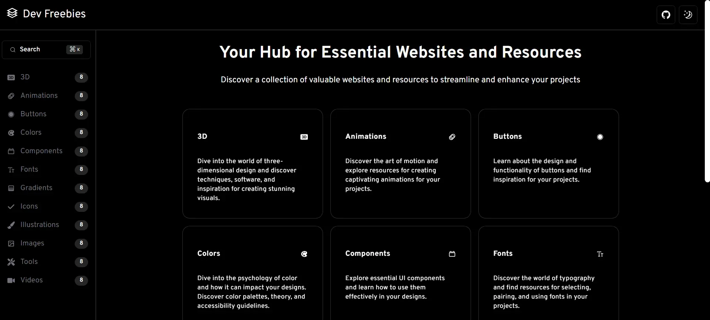

# Dev Freebies

Dev Freebies is a curated collection of free resources designed to enhance and streamline the development process. Our goal is to help developers discover a wide range of tools, libraries, and assets that can accelerate their projects and achieve their objectives. It is important to note that all links that appear on this website are external and do not belong to us. We do not claim ownership of any of the linked content or resources. The copyrights and trademarks associated with these resources belong to their respective owners. Take a look [dev-freebies](https://dev-freebies.vercel.app/)

## ⚙️ Features

- You will find a large number of links to useful resources for creating applications.

## 👨‍💻 Technologies used

- [**React 18**](https://react.dev/) - The library for web and native user interfaces.
- [**Next.js 14**](https://nextjs.org/) - The React Framework for the Web
- [**TypeScript**](https://www.typescriptlang.org/) - TypeScript is a strongly typed programming language that builds on JavaScript.
- [**Shadcn/ui**](https://ui.shadcn.com//) - Beautifully designed components that you can copy and paste into your apps.
- [**Tailwindcss**](https://tailwindcss.com/) - A utility-first CSS framework.
- [**Prettier**](https://prettier.io/) + [prettier-plugin-tailwindcss](https://github.com/tailwindlabs/prettier-plugin-tailwindcss) - CSS formatter.

## 🚀 Getting Started

First, run the development server:

```bash
npm install
npm run dev
```

Application opens on port 3000


<div align="center">


</div>

# ✉️ License

This website is licensed under the MIT License [License](https://github.com/Reyes1921/dev-freebies/blob/main/LICENSE)
